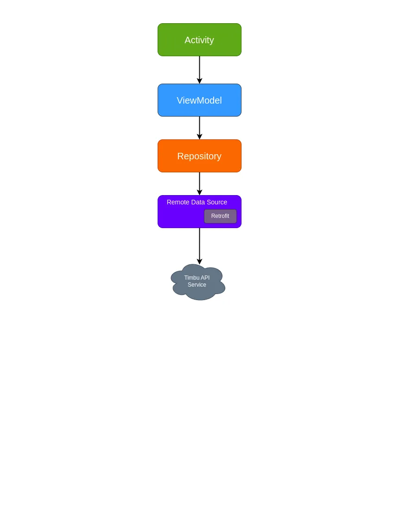
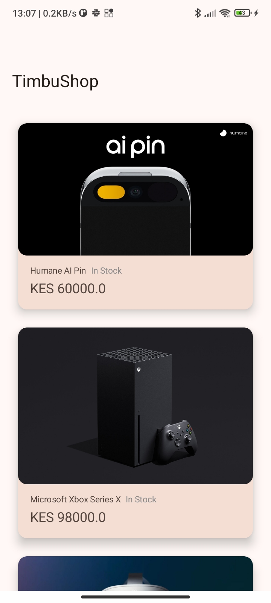
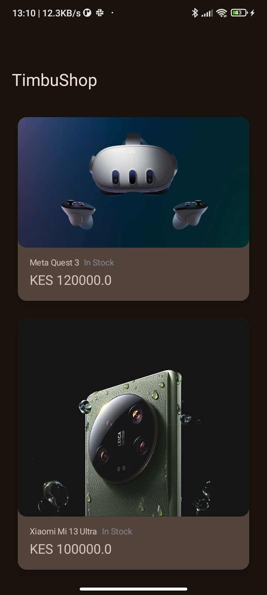
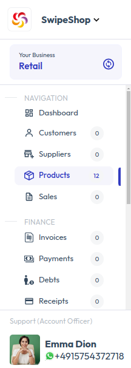
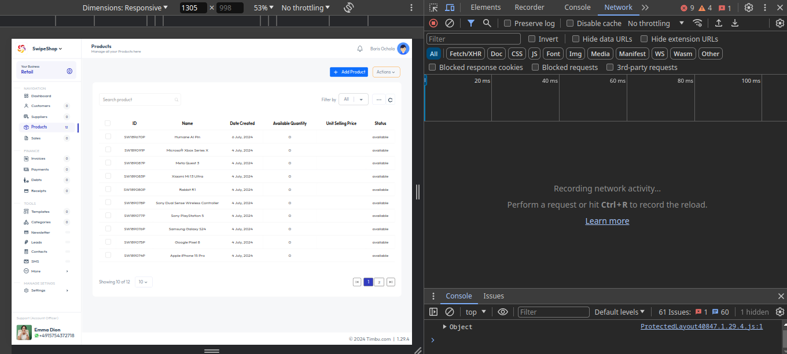
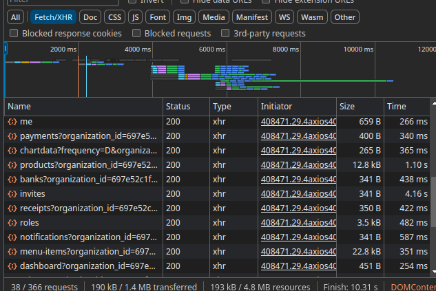

## TimbuShop
A simple Android application that consumes the [Timbu API](https://docs.timbu.cloud/api/intro) and displays the response in a list.

## Demo
- [Appetize](https://appetize.io/app/b_fhezgnwkx5gbkzohck4bczvsci)
- Go to releases for the [APK](https://github.com/slowburn-404/HNGInternship/releases/tag/v1.0.0)

## Features
- List products.
- Pull to refresh.

## Architecture Overview
- The application utilizes the Model-View-ViewModel (MVVM) architecture pattern. The Model ([Data layer](app/src/main/java/dev/borisochieng/timbushop/data/)) is responsible for data retrieval from the API and uses the repository pattern.
- The [UI layer](app/src/main/java/dev/borisochieng/timbushop/ui/) wraps the View, which consists of [Activities](https://developer.android.com/guide/components/activities/intro-activities) made up of UI elements called Composables, and the ViewModel, holds the state for the screen (View) and data retrieved from the Model.



## Technology Stack
- **[Kotlin](https://kotlinlang.org/)**: The official programming language for developing Android applications.
- **[Jetpack Compose](https://developer.android.com/develop/ui/compose)**: A modern UI toolkit for building Android applications in Kotlin.
- **[Retrofit](https://github.com/square/retrofit)**: A HTTP client for Android used to make network calls to the Timbu API.
- **[Coil](https://coil-kt.github.io/coil/)**: A lightweight image loading library.
- **[Coroutines](https://developer.android.com/kotlin/coroutines#:~:text=A%20coroutine%20is%20a%20concurrency,established%20concepts%20from%20other%20languages)**: A concurrency design pattern in Kotlin used to make asynchronous network calls (on a background thread).
- **[Gson](https://github.com/google/gson)**: A library used to convert Kotlin objects to and from JSON (serialization and deserialization).
- **[OkHttp](https://square.github.io/okhttp/)**: An HTTP client library for Android and Java applications used to make network requests.
- **[OkHttp Logging Interceptor](https://github.com/square/okhttp/tree/master/okhttp-logging-interceptor)**: Used for logging HTTP request and response data.
- **[ViewModel](https://developer.android.com/topic/libraries/architecture/viewmodel)**: A lifecycle-aware Android Architecture Component for holding state.

## Screenshots

| Light | Dark |
|:---:|:---:|
|  |  |

## Setup Instructions

1. **Clone the repository to your local machine.**
```bash
git clone https://github.com/slowburn-404/HNGInternship.git

cd HNGInternship/TimbuShop
```
2. **Open in Android Studio**
- Open Android Studio
- Select `File` > `Open...`

3. **Retrieve an API Key for authentication.**
- Create an account on [Timbu Cloud](http://timbu.cloud/).
- Follow this [guide](https://docs.timbu.cloud/api/Api-Keys/create-apikeys) to retrieve your API Key and App ID.

4. **Retrieve the `organization_id`**
- For some reason, the documentation or the Timbu dashboard does not provide the value of the organization ID, which is an argument passed to the `organization_id` URL parameter required when making the API call. We will need to find a workaround to get it.
- Head over to the Timbu dashboard.
- In the side menu, select Products.



- Open Developer Tools in your browser by hitting the `F12` key or right-clicking anywhere on the page and selecting `Inspect`.



- At the top right, you will see tabs named Elements, Recorder, etc. Click on the arrow and select Network.

- Now we will inspect the HTTP responses from the network. Select `Fetch/XHR` to view all JSON files we get from the network call.


- Refresh the web page, and you will notice the empty field below being updated.



- Scroll down and try to find the JSON file whose name starts with `products?organization_id=`. Click on it and view the details.
- Within the file, locate the value assigned to the `organization_id` property. That is your organization ID.

- In the root directory of your project, add the API Key, App ID, and the Organization ID to the `local.properties` file.

```
apiKey=YOUR_API_KEY
orgID=YOUR_ORGANIZATION_ID
appID=YOUR_APP_ID
```
5. **Build and run the app**
- Ensure your Android device or emulator is set up.
- Click on the `Run` button or use `Shift + F10`.

## License
This project is licensed under the Apache-2.0 License. See the [LICENSE](../LICENSE) file for more details.
