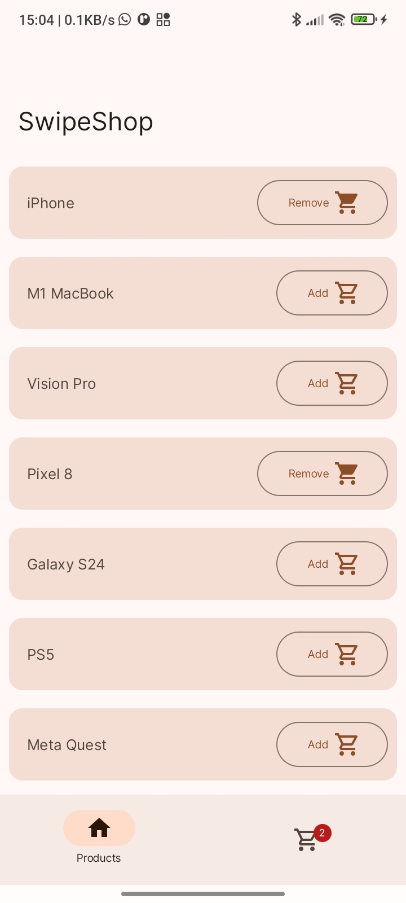
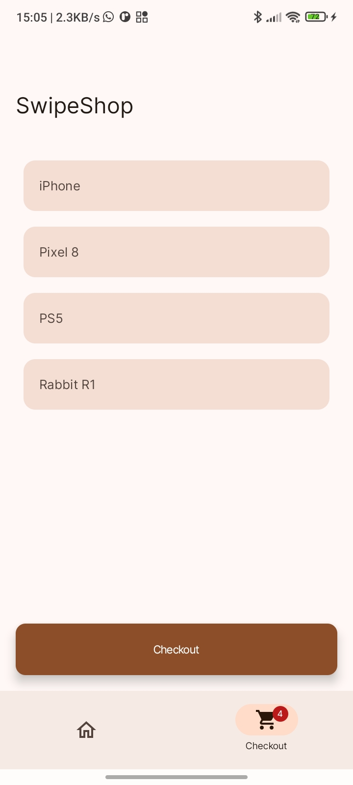
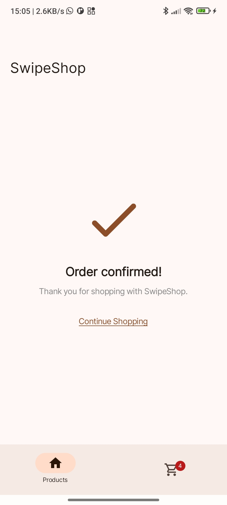

# SwipeShop
Simple applicaition submitted in Stage 1 of the [HNG Internship Program.](https://hng.tech/internship)
## Demo
- [Appetize](https://appetize.io/app/xrnw3mendmxvgxq5f5h2lfzzpm?device=pixel7&osVersion=13.0)
- [APK](app/release/app-release.apk)
 
## Technology Stack
- [Kotlin](https://kotlinlang.org/) : The official programming language for building Android Applications
- [Jetpack Compose](https://developer.android.com/develop/ui/compose) : A Modern UI toolkit building native Android Applications that follows a declarative approach

## Features
- Product Listing
- Cart Listing
- Add/remove to/from cart

## Screenshots




## Installation

1. **Clone the repository**:
    ```bash
    git clone https://github.com/slowburn-404/HNGInternship.git
    cd HNGInternship/SwipeShop
    ```

2. **Open in Android Studio**:
    - Open Android Studio
    - Select `File` > `Open...`
    - Navigate to the cloned repository directory; HNGInternship -> SwipeShop and click `Open`

3. **Build and run the app**:
    - Ensure your Android device or emulator is set up
    - Click on the `Run` button or use `Shift + F10`


## License
This project is licensed under the Apache-2.0 License. See the [LICENSE](../LICENSE) file for details.
